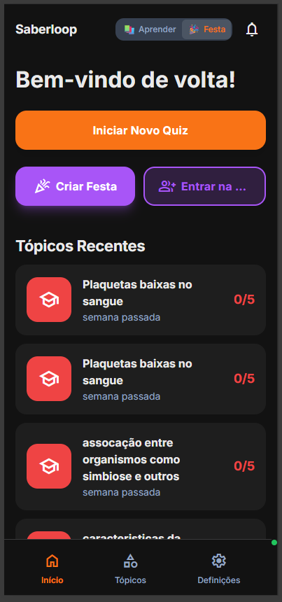
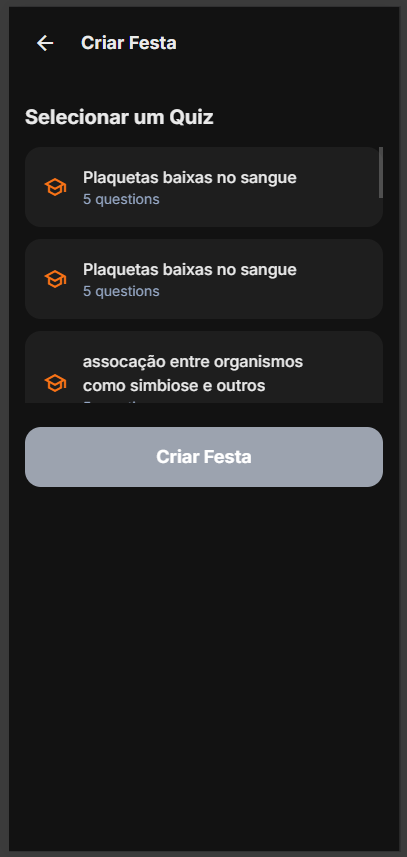
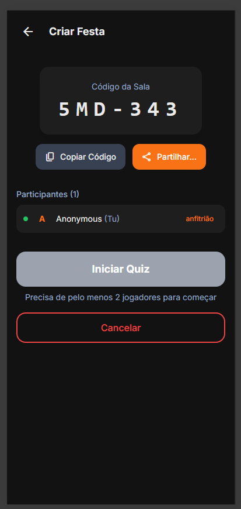
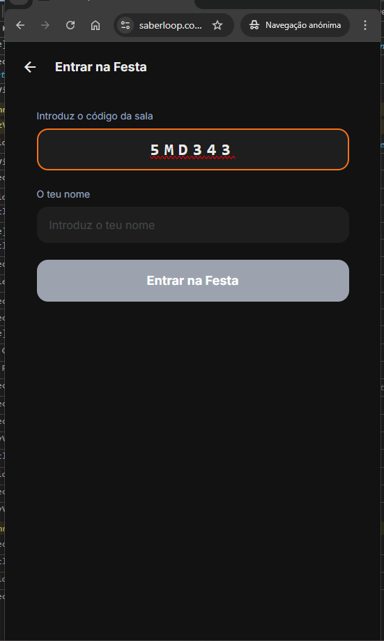
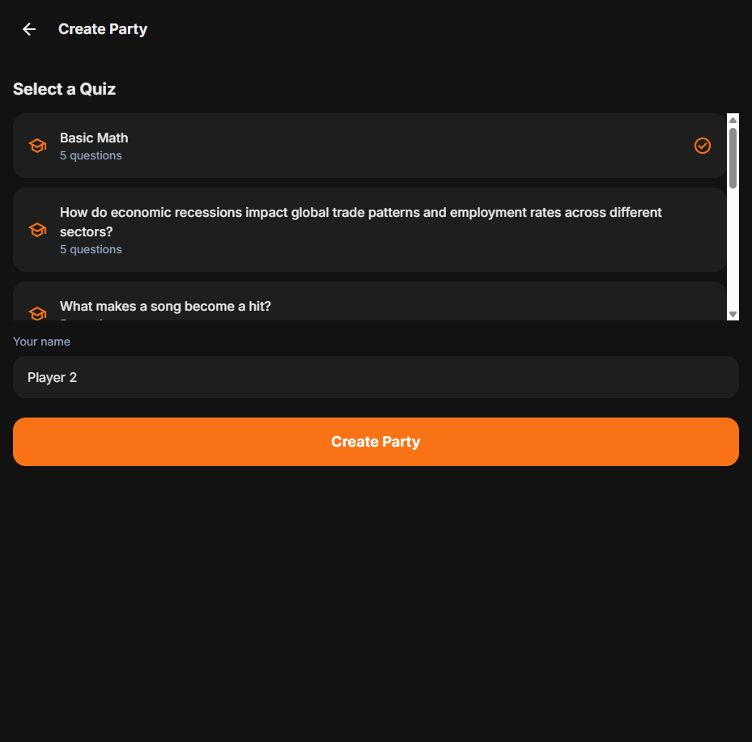

# Issue #111: Allow host to set their name when starting a party

**GitHub:** https://github.com/vitorsilva/saberloop/issues/111
**Status:** Open
**Created:** 2026-01-15
**Labels:** bug, party-mode
**Branch:** `fix/issue-111-host-name-input`

---

## Problem

When the host starts a party quiz, they are not prompted to enter their name. As a result, the host always appears as "Anonymous" in the scoreboard, while guests have proper names because they enter them when joining.

## Expected Behavior

Host should be able to set their display name when starting a party, so they appear with a proper name in the scoreboard alongside guests.

## Current Behavior

- Guest flow: Asked for name when joining → name appears in scoreboard
- Host flow: No name prompt → shows as "Anonymous" in scoreboard

## Root Cause Analysis

**File:** `src/views/CreatePartyView.js`

The party creation flow does not include a name input field for the host. When the host creates a party:
1. Host selects a quiz and clicks "Create Party"
2. Party session is created without collecting host's name
3. Host name defaults to "Anonymous" in the session state

**Comparison with guest flow:**
- Guest flow (`JoinPartyView.js`) prompts for name before joining
- Host flow (`CreatePartyView.js`) skips name collection entirely

---

## Solution Design

### Approach

Add a name input field to `CreatePartyView.js` similar to the pattern used in `JoinPartyView.js`:
1. Add name input field to the create party form
2. Validate name before allowing party creation
3. Pass host name to party session when creating

### Current Flow (Screenshots)

| Step | Screenshot | Description |
|------|------------|-------------|
| 1 |  | Host clicks "Criar Festa" on home screen |
| 2 |  | Host selects quiz - **NO name input here** |
| 3 |  | Host appears as "Anonymous (Tu)" |
| 4 |  | Guest flow HAS name input ("O teu nome") |

### Problem Highlighted

The quiz selection screen (Step 2) goes directly to "Criar Festa" without asking for the host's name, while the guest join screen (Step 4) has the "O teu nome" field.

### Proposed UI Change

Add a name input field to the quiz selection screen (111_2), positioned between the quiz list and the "Criar Festa" button, matching the guest flow style:

```
┌─────────────────────────────────────┐
│  ← Criar Festa                      │
├─────────────────────────────────────┤
│                                     │
│  Selecionar um Quiz                 │
│                                     │
│  ┌─────────────────────────────┐   │
│  │ 🎓 Plaquetas baixas...      │   │
│  │    5 questions              │   │
│  └─────────────────────────────┘   │
│  ┌─────────────────────────────┐   │
│  │ 🎓 assocação entre...       │   │
│  │    5 questions              │   │
│  └─────────────────────────────┘   │
│                                     │
│  O teu nome                         │  ← NEW
│  ┌─────────────────────────────┐   │
│  │ Introduz o teu nome         │   │  ← NEW (same as guest)
│  └─────────────────────────────┘   │
│                                     │
│  ┌─────────────────────────────┐   │
│  │       Criar Festa           │   │
│  └─────────────────────────────┘   │
│                                     │
└─────────────────────────────────────┘
```

### Expected Result

After fix, the waiting room (Step 3) will show the host's entered name instead of "Anonymous":

```
BEFORE                          AFTER
┌───────────────────┐          ┌───────────────────┐
│ Participantes (1) │          │ Participantes (1) │
│                   │          │                   │
│ ● A Anonymous(Tu) │          │ ● J João (Tu)     │
│     anfitrião     │          │     anfitrião     │
└───────────────────┘          └───────────────────┘
```

### Input Field Styling

Match the existing guest name input from `JoinPartyView.js` (see 111_4.png):

```html
<div class="mt-4">
  <label class="text-text-light dark:text-text-dark font-medium mb-2 block">
    ${t('party.yourName')}
  </label>
  <input
    type="text"
    id="hostName"
    maxlength="20"
    placeholder="${t('party.enterName')}"
    class="w-full px-4 py-3 rounded-xl
           bg-card-light dark:bg-card-dark
           text-text-light dark:text-text-dark
           border-2 border-transparent
           focus:border-primary focus:outline-none
           placeholder:text-subtext-light/50"
    data-testid="host-name-input"
  />
</div>
```

---

## Proposed Solution

Add a name input field to the party creation flow for the host, similar to what guests see when joining.

## Acceptance Criteria

- [x] Host is prompted to enter their name when starting a party
- [x] Host's name appears correctly in the scoreboard
- [x] Host's name is visible to guests in the party session
- [x] Name field has reasonable validation (not empty, max length)
- [x] i18n translations added for new UI elements (label, placeholder) - reused existing keys

---

## Files to Change

| File | Change |
|------|--------|
| `src/views/CreatePartyView.js` | Add name input field to party creation form |
| `src/services/party-session.js` | Accept host name when creating session |
| `src/i18n/locales/*.json` | Add translation for name input placeholder/label |

---

## Testing Plan

### Unit Tests

**File:** `tests/unit/views/CreatePartyView.test.js`

| Test Case | Description |
|-----------|-------------|
| `should render name input field` | Verify name input exists in form |
| `should validate name is not empty` | Cannot create party with empty name |
| `should enforce max length on name input` | Verify maxlength attribute |
| `should pass host name to party session` | Verify name is included when creating |

### E2E Tests (Playwright)

**File:** `tests/e2e/party-mode.spec.js`

| Test Case | Description |
|-----------|-------------|
| `host should see name input on create party screen` | Verify input field exists |
| `host should enter name when creating party` | Complete create flow with name |
| `should not allow empty name for host` | Button disabled without name |
| `host name should appear in waiting room` | Verify host name displays in participant list |
| `host name should appear in scoreboard after quiz` | Verify name in results |

### Maestro Tests

**File:** `.maestro/flows/party-host-name.yaml`

| Test Case | Description |
|-----------|-------------|
| `host name input flow (Android)` | Create party with name on Android |
| `host name input flow (iOS)` | Create party with name on iOS |

### Manual Testing Checklist

**Justification:** These require real 2-device coordination that's impractical to automate.

- [ ] Host's name is visible to guests on their device (requires 2 real devices)
- [ ] Host name persists correctly through full party quiz flow with real participants

---

## Pre-Implementation Checklist

- [x] Root cause identified
- [x] Solution designed
- [x] Testing plan defined
- [x] Branch created
- [x] Plan validated by user

---

## Implementation Notes

### Changes Made

**`src/views/CreatePartyView.js`** (72 lines added, 4 modified):
1. Added name input field in `render()` method (lines 71-90):
   - Same styling as guest name input in JoinPartyView
   - Uses existing i18n keys (`party.yourName`, `party.enterName`)
   - `maxlength="20"` to match guest limits
   - `data-testid="host-name-input"` for E2E testing
   - Pre-fills from `localStorage.getItem('partyPlayerName')`

2. Updated `attachListeners()` method:
   - Added input listener for name field
   - Saves name to localStorage on input for persistence
   - Calls `_updateCreateButtonState()` on input

3. Added `_updateCreateButtonState()` method (lines 238-253):
   - Enables Create button only when BOTH quiz AND name are provided
   - Replaces old logic that only checked for quiz selection

4. Updated `createRoom()` method:
   - Gets host name from input field
   - Validates name before proceeding
   - Passes actual host name to API (was hardcoded `'You'`)

### Testing

- 6 new E2E tests added in `tests/e2e/party-mode.spec.js` (lines 451-550)
- All 119 E2E tests pass
- All 779 unit tests pass

### Design Decisions

1. **Shared localStorage key**: Using `partyPlayerName` for both host and guest so name persists regardless of role. If user joins as guest first and later hosts, their name carries over.

2. **Save on input vs save on create**: Chose to save on input (not just on create) so name persists even if user navigates away before creating the party.

3. **No new i18n keys needed**: Reused `party.yourName` and `party.enterName` from guest flow.

### After Screenshot



The new "Your name" input field appears between the quiz list and the Create Party button, matching the guest flow styling.

---

## Branch & Commit Strategy

### Branch

```
fix/issue-111-host-name-input
```

Created from `main` in worktree: `../demo-pwa-app-issue-111`

### Commit Plan

| Order | Commit Message | Description |
|-------|----------------|-------------|
| 1 | `test(party): add failing test for host name input` | Write failing E2E test first (TDD) |
| 2 | `fix(party): add name input to party creation flow` | Implement the host name input |
| 3 | `docs(issues): update plan for issue 111` | Update this document |

### Commit Message Format

```
<type>(scope): <description>

- Detail 1
- Detail 2

Co-Authored-By: Claude Opus 4.5 <noreply@anthropic.com>
```

---

## References

### Feature Context
- [Party Mode Phase 3](../learning/epic06_sharing/PHASE3_PARTY_SESSION.md)
- Related: #112 (screen name setting - builds on this)

### How-To Guides
- [Deployment (Staging & Production)](../architecture/DEPLOYMENT.md)
- [Unit Testing](../developer-guide/UNIT_TESTING.md)
- [E2E Testing (Playwright)](../developer-guide/E2E_TESTING.md)
- [Maestro Testing](../developer-guide/MAESTRO_TESTING.md)
- [Internationalization (i18n)](../developer-guide/I18N.md)
