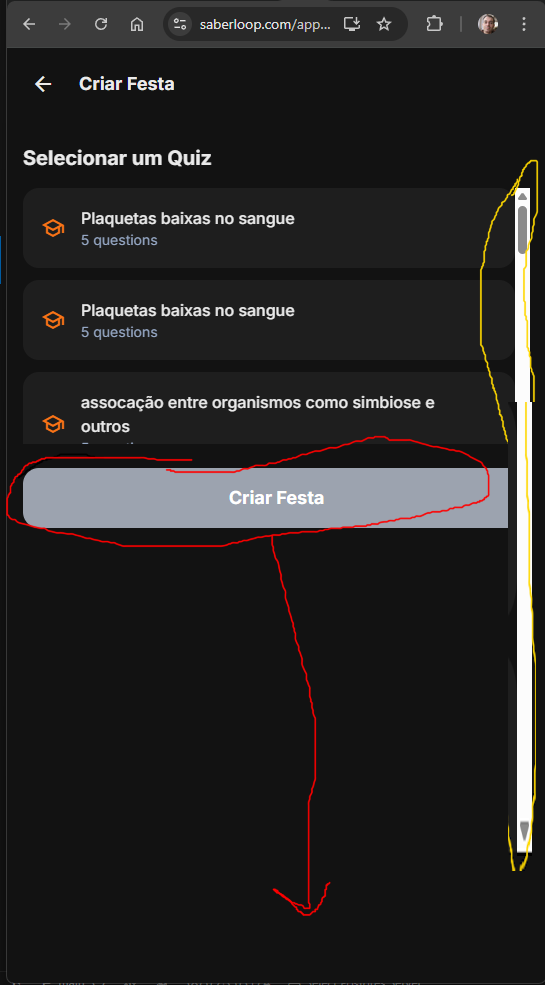
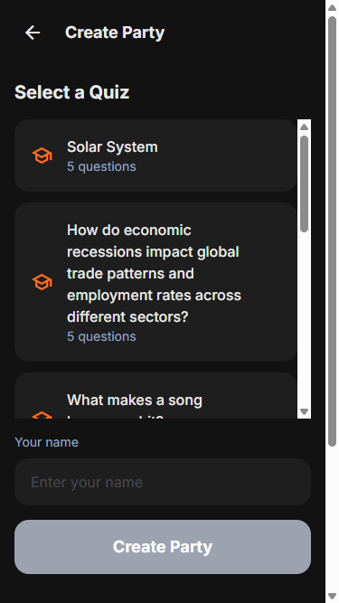

# Issue #121: Quiz selection area too small on Create Party screen

**GitHub:** https://github.com/vitorsilva/saberloop/issues/121
**Status:** Closed
**Created:** 2026-01-15
**Labels:** enhancement, party-mode, ui
**Branch:** `fix/issue-121-quiz-selection-layout`
**Depends On:** [Issue #111](./111.md) - Must be implemented after #111 is closed

---

## Dependency Note

⚠️ **This issue depends on Issue #111 (Add host name input).**

Issue #111 will add a name input field to the Create Party screen. This issue should be implemented AFTER #111 is merged because:
1. The UI layout will change when the name input is added
2. The layout fix should account for the new name input field
3. Avoids having to redo layout work

---

## Problem

On the Create Party screen, the quiz selection area is too small, making it hard to browse available quizzes. There's wasted space below the quiz list.

### Current State



**Issues:**
- Quiz list has limited height (only shows ~3 quizzes)
- "Criar Festa" button floats in the middle of the screen
- Large empty area below the button is wasted

---

## Expected Behavior

After Issue #111 is implemented, the Create Party screen will have:
- Quiz list (scrollable)
- Name input field (added by #111)
- "Criar Festa" (Create Party) button

**Layout requirements:**
- Quiz list should expand to fill available vertical space
- Quiz list should be scrollable if there are many quizzes
- Name input field should be visible (not hidden by scroll)
- "Criar Festa" button should be **fixed at the bottom** of the screen

---

## Solution

Use flexbox layout to accommodate quiz list, name input (from #111), and button:

```
┌─────────────────────────────────────┐
│  ← Criar Festa (header)             │
├─────────────────────────────────────┤
│                                     │
│  Selecionar um Quiz                 │
│                                     │
│  ┌─────────────────────────────┐   │  ← Scrollable
│  │ 🎓 Quiz 1                   │   │     quiz list
│  └─────────────────────────────┘   │     (flex: 1)
│  ┌─────────────────────────────┐   │
│  │ 🎓 Quiz 2                   │   │
│  └─────────────────────────────┘   │
│  ┌─────────────────────────────┐   │
│  │ 🎓 Quiz 3                   │   │
│  └─────────────────────────────┘   │
│                                     │
├─────────────────────────────────────┤
│  O teu nome (from #111)             │  ← Fixed height
│  ┌─────────────────────────────┐   │     (flex-shrink: 0)
│  │ Introduz o teu nome         │   │
│  └─────────────────────────────┘   │
├─────────────────────────────────────┤
│  ┌─────────────────────────────┐   │  ← Fixed at bottom
│  │       Criar Festa           │   │     (flex-shrink: 0)
│  └─────────────────────────────┘   │
└─────────────────────────────────────┘
```

```css
/* Container */
.create-party-container {
  display: flex;
  flex-direction: column;
  height: 100%;
}

/* Quiz list - expands to fill space */
.quiz-list {
  flex: 1;
  overflow-y: auto;
  min-height: 0; /* Important for flex scroll */
}

/* Name input - fixed height (added by #111) */
.name-input-section {
  flex-shrink: 0;
}

/* Button - fixed at bottom */
.create-button {
  flex-shrink: 0;
  /* or use sticky positioning */
}
```

---

## Files to Change

| File | Changes |
|------|---------|
| `src/views/CreatePartyView.js` | Update layout structure |

---

## Acceptance Criteria

- [x] Quiz list expands to fill available space
- [x] Name input field (from #111) remains visible (not scrolled away)
- [x] "Criar Festa" button fixed at bottom
- [x] Quiz list scrolls when many quizzes exist
- [x] Works on mobile and desktop viewports

---

## Testing Plan

### E2E Tests (Playwright)

**File:** `tests/e2e/party-mode.spec.js`

| Test Case | Description |
|-----------|-------------|
| `quiz list should fill available space on create party` | Verify layout expansion |
| `create party button should be at bottom` | Verify button position |
| `quiz list should be scrollable with many quizzes` | Scroll behavior test |

### Visual Regression

Capture before/after screenshots at:
- Mobile viewport (375x667)
- Desktop viewport (1280x720)

### Manual Testing Checklist

- [ ] Quiz list expands to fill screen height
- [ ] Create Party button fixed at bottom
- [ ] Can scroll quiz list when many quizzes
- [ ] Works on mobile viewport
- [ ] Works on desktop viewport
- [ ] No layout issues when few quizzes (< 3)

---

## Definition of Done

- [x] Fix implemented
- [x] Tested on mobile viewport
- [x] Before/after screenshots captured
- [x] PR created and merged

---

## Pre-Implementation Checklist

- [x] **Issue #111 closed** (dependency - adds name input to this screen)
- [x] Root cause identified (N/A - UI enhancement)
- [x] Solution designed
- [x] Testing plan defined
- [x] Branch created
- [x] Plan validated by user

---

## Branch & Commit Strategy

### Branch

```
fix/issue-121-quiz-selection-layout
```

Created from `main` in worktree: `../demo-pwa-app-issue-121`

### Commit Plan

| Order | Commit Message | Description |
|-------|----------------|-------------|
| 1 | `fix(party): expand quiz list to fill available space` | Update CreatePartyView layout |
| 2 | `test(party): add visual regression test for create party layout` | Add E2E test coverage |
| 3 | `docs(issues): update plan for issue 121` | Update this document |

### Commit Message Format

```
<type>(scope): <description>

- Detail 1
- Detail 2

Co-Authored-By: Claude Opus 4.5 <noreply@anthropic.com>
```

---

## Implementation Progress

### Changes Made

**`src/views/CreatePartyView.js`** (7 lines changed):

1. Changed outer container from `min-h-screen` to `h-screen`:
   - Constrains total height to viewport for proper flex layout
   - Changed `overflow-x-hidden` to `overflow-hidden`

2. Updated content container from `flex-grow px-4 pb-24` to `flex-1 px-4 pb-4 flex flex-col min-h-0`:
   - Uses flex column layout
   - `min-h-0` allows content to shrink below minimum content size

3. Updated `selectQuizSection` from `py-6` to `flex flex-col flex-1 min-h-0 py-4`:
   - Uses flex column layout
   - `flex-1` allows section to grow and fill available space
   - `min-h-0` is critical for nested flex scroll containers

4. Changed quiz list from `max-h-64 overflow-y-auto` to `flex-1 min-h-0 overflow-y-auto`:
   - Removed fixed height limit (`max-h-64` = 256px)
   - Quiz list now expands to fill remaining space
   - Scrolls when content exceeds available space

5. Added `flex-shrink-0` to:
   - Heading (prevents title from shrinking)
   - Name input container (stays visible at fixed size)
   - Create Party button (stays at bottom with fixed size)

### Testing Results

- 4 new E2E tests added in `tests/e2e/party-mode.spec.js` (lines 552-632)
- All 29 party-mode E2E tests pass
- All 129 E2E tests pass (1 flaky test requires backend)

### After Screenshot



The quiz list now fills available space, the name input is visible, and the Create Party button is fixed at the bottom of the screen.

---

## References

**Dependencies:**
- [Issue #111: Add host name input](./111.md) - **MUST be completed first** - adds name input that affects this layout

**Documentation:**
- [Party Mode Phase 3](../learning/epic06_sharing/PHASE3_PARTY_SESSION.md) - Party Mode implementation
- [E2E Testing Guide](../developer-guide/E2E_TESTING.md) - How to write visual regression tests

**Source Files:**
- `src/views/CreatePartyView.js` - Main file to modify
