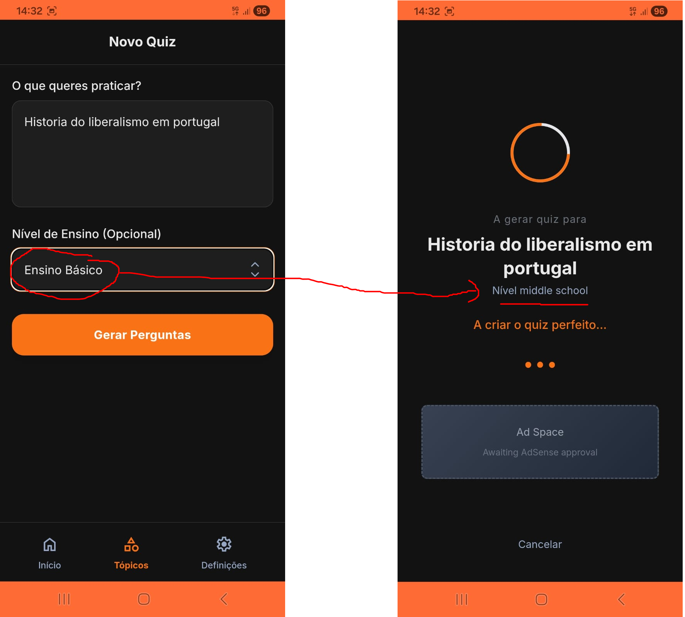

# Issue #138: Difficulty level not translated on quiz generation screen

**GitHub:** https://github.com/vitorsilva/saberloop/issues/138
**Status:** Plan Ready
**Created:** 2026-01-16
**Labels:** bug
**Branch:** `fix/issue-138-grade-level-translation`

---

## Problem

When generating a quiz, the loading screen shows the difficulty level in English regardless of the selected language. For example, when using Portuguese and selecting "Ensino Básico", the loading screen displays "Nível middle school" instead of "Nível Ensino Básico".

**Current State:**
- User selects "Ensino Básico" (Portuguese translation of middle school)
- Loading screen shows "Nível middle school" (mixed Portuguese/English)

**Expected State:**
- Loading screen should show "Nível Ensino Básico" (fully translated)

**Screenshot:**



The image shows:
- Left: User selected "Ensino Básico" in the dropdown
- Right: Loading screen displays "Nível middle school" instead of "Nível Ensino Básico"

---

## Root Cause Analysis

The bug is in `src/views/LoadingView.js` at line 71:

```javascript
${t('loading.level', { level: gradeLevel || t('topicInput.middleSchool') })}
```

**The problem:**
1. `TopicInputView.js` stores the raw English value in state (`"middle school"`, `"high school"`, `"college"`)
2. `LoadingView.js` interpolates this raw value directly into the translation
3. The `t('loading.level', { level: gradeLevel })` outputs "Nível middle school" because `gradeLevel` contains the untranslated English value

**Data flow:**
```
TopicInputView: <option value="middle school">${t('topicInput.middleSchool')}</option>
                       ↓
                 state.set('currentGradeLevel', 'middle school')  ← Raw English value
                       ↓
LoadingView: t('loading.level', { level: gradeLevel })
                       ↓
             "Nível middle school"  ← Bug: English value interpolated into Portuguese string
```

---

## Proposed Solution

Create a helper function to translate grade level values back to their localized display text.

### Option A: Helper function in LoadingView (Recommended - minimal change)

Add a mapping function to translate grade level values:

```javascript
// In LoadingView.js
getTranslatedGradeLevel(gradeLevel) {
  const gradeLevelMap = {
    'middle school': t('topicInput.middleSchool'),
    'high school': t('topicInput.highSchool'),
    'college': t('topicInput.college')
  };
  return gradeLevelMap[gradeLevel] || gradeLevel;
}
```

Then update line 71:
```javascript
${t('loading.level', { level: this.getTranslatedGradeLevel(gradeLevel) || t('topicInput.middleSchool') })}
```

### Option B: Utility function (if reused elsewhere)

If this pattern is needed in other views, create a shared utility:

```javascript
// src/utils/gradeLevel.js
import { t } from '../core/i18n.js';

export const GRADE_LEVELS = ['middle school', 'high school', 'college'];

export function translateGradeLevel(value) {
  const map = {
    'middle school': t('topicInput.middleSchool'),
    'high school': t('topicInput.highSchool'),
    'college': t('topicInput.college')
  };
  return map[value] || value;
}
```

### Recommendation

Use **Option A** (helper in LoadingView) since this is currently the only place needing this translation. If future views need it, refactor to Option B.

---

## Acceptance Criteria

- [ ] Loading screen displays translated grade level (not raw English value)
- [ ] Works for all grade levels: middle school, high school, college
- [ ] Works for all supported languages (en, pt-PT, es, fr, de, it, nl, no, ru)
- [ ] Fallback to default translation if grade level is empty/null
- [ ] No regression in existing functionality

---

## Files to Change

| File | Change |
|------|--------|
| `src/views/LoadingView.js` | Add helper function and update line 71 |

---

## Testing Plan

### Documentation Links

| Task | Documentation |
|------|---------------|
| Run unit tests | [Unit Testing Guide](../developer-guide/UNIT_TESTING.md) |
| Run E2E tests | [E2E Testing Guide](../developer-guide/E2E_TESTING.md) |
| Run Maestro tests | [Maestro Testing Guide](../developer-guide/MAESTRO_TESTING.md) |
| Deploy to staging | [Staging Deployment Guide](../developer-guide/STAGING_DEPLOYMENT.md) |
| Deploy to production | [Production Deployment Guide](../architecture/DEPLOYMENT.md) |

### E2E Tests (Playwright)

Create `tests/e2e/loading-grade-level.spec.js`:

```javascript
import { test, expect } from '@playwright/test';

test.describe('Loading screen grade level translation', () => {
  // Test Portuguese with all grade levels
  test('Portuguese: shows "Nível Ensino Básico" for middle school', async ({ page }) => {
    await page.goto('/#/settings');
    await page.locator('[data-testid="language-select"]').selectOption('pt-PT');

    await page.goto('/#/topic-input');
    await page.fill('[data-testid="topic-input"]', 'Test topic');
    await page.locator('#gradeLevelSelect').selectOption('middle school');
    await page.click('[data-testid="generate-quiz-btn"]');

    await expect(page.locator('text=Nível Ensino Básico')).toBeVisible();
  });

  test('Portuguese: shows "Nível Ensino Secundário" for high school', async ({ page }) => {
    await page.goto('/#/settings');
    await page.locator('[data-testid="language-select"]').selectOption('pt-PT');

    await page.goto('/#/topic-input');
    await page.fill('[data-testid="topic-input"]', 'Test topic');
    await page.locator('#gradeLevelSelect').selectOption('high school');
    await page.click('[data-testid="generate-quiz-btn"]');

    await expect(page.locator('text=Nível Ensino Secundário')).toBeVisible();
  });

  test('Portuguese: shows "Nível Universidade" for college', async ({ page }) => {
    await page.goto('/#/settings');
    await page.locator('[data-testid="language-select"]').selectOption('pt-PT');

    await page.goto('/#/topic-input');
    await page.fill('[data-testid="topic-input"]', 'Test topic');
    await page.locator('#gradeLevelSelect').selectOption('college');
    await page.click('[data-testid="generate-quiz-btn"]');

    await expect(page.locator('text=Nível Universidade')).toBeVisible();
  });

  // Test Spanish
  test('Spanish: shows "Nivel Secundaria" for middle school', async ({ page }) => {
    await page.goto('/#/settings');
    await page.locator('[data-testid="language-select"]').selectOption('es');

    await page.goto('/#/topic-input');
    await page.fill('[data-testid="topic-input"]', 'Test topic');
    await page.locator('#gradeLevelSelect').selectOption('middle school');
    await page.click('[data-testid="generate-quiz-btn"]');

    await expect(page.locator('text=Nivel Secundaria')).toBeVisible();
  });

  // Test English (baseline)
  test('English: shows "Level Middle School" for middle school', async ({ page }) => {
    await page.goto('/#/settings');
    await page.locator('[data-testid="language-select"]').selectOption('en');

    await page.goto('/#/topic-input');
    await page.fill('[data-testid="topic-input"]', 'Test topic');
    await page.locator('#gradeLevelSelect').selectOption('middle school');
    await page.click('[data-testid="generate-quiz-btn"]');

    await expect(page.locator('text=Level Middle School')).toBeVisible();
  });

  // Test default grade level (no selection)
  test('defaults to translated middle school when no level selected', async ({ page }) => {
    await page.goto('/#/settings');
    await page.locator('[data-testid="language-select"]').selectOption('pt-PT');

    await page.goto('/#/topic-input');
    await page.fill('[data-testid="topic-input"]', 'Test topic');
    // Don't select grade level - should default to middle school
    await page.click('[data-testid="generate-quiz-btn"]');

    await expect(page.locator('text=Nível Ensino Básico')).toBeVisible();
  });
});
```

### Maestro Tests (Mobile)

Create `.maestro/flows/loading-grade-level-translation.yaml`:

```yaml
appId: com.saberloop.app
name: Loading screen shows translated grade level
---
# Set Portuguese language
- tapOn: "Definições"
- tapOn:
    id: "language-select"
- tapOn: "Português"

# Create quiz with high school level
- tapOn: "Tópicos"
- tapOn:
    id: "topic-input"
- inputText: "Test topic"
- tapOn:
    id: "gradeLevelSelect"
- tapOn: "Ensino Secundário"
- tapOn: "Gerar Perguntas"

# Verify loading screen shows translated level
- assertVisible: "Nível Ensino Secundário"
```

### Screenshots

| Screenshot | Filename | Description |
|------------|----------|-------------|
| Before | `138-before.png` | Loading screen with "Nível middle school" |
| After | `138-after.png` | Loading screen with "Nível Ensino Básico" |

### Manual Testing (only if automated tests cannot cover)

None required - all scenarios covered by E2E and Maestro tests above.

---

## Pre-Implementation Checklist

- [x] Root cause identified
- [x] Solution designed
- [x] Testing plan defined
- [ ] Branch created
- [x] Plan validated by user

---

## Implementation Notes

*To be filled during implementation.*

---

## Branch & Commit Strategy

### Branch

```
fix/issue-138-grade-level-translation
```

### Commit Plan

| Order | Commit Message |
|-------|----------------|
| 1 | `fix(i18n): translate grade level on loading screen` |
| 2 | `test(e2e): add test for translated grade level on loading` |
| 3 | `docs(issues): mark issue 138 as fixed` |

---

## References

### Code
- Bug location: `src/views/LoadingView.js:71`
- Grade level select: `src/views/TopicInputView.js:26-31`
- Translations: `public/locales/*.json` (topicInput.middleSchool, topicInput.highSchool, topicInput.college)

### Related
- i18n module: `src/core/i18n.js`
- Grade level settings: `src/views/SettingsView.js:62-64`
