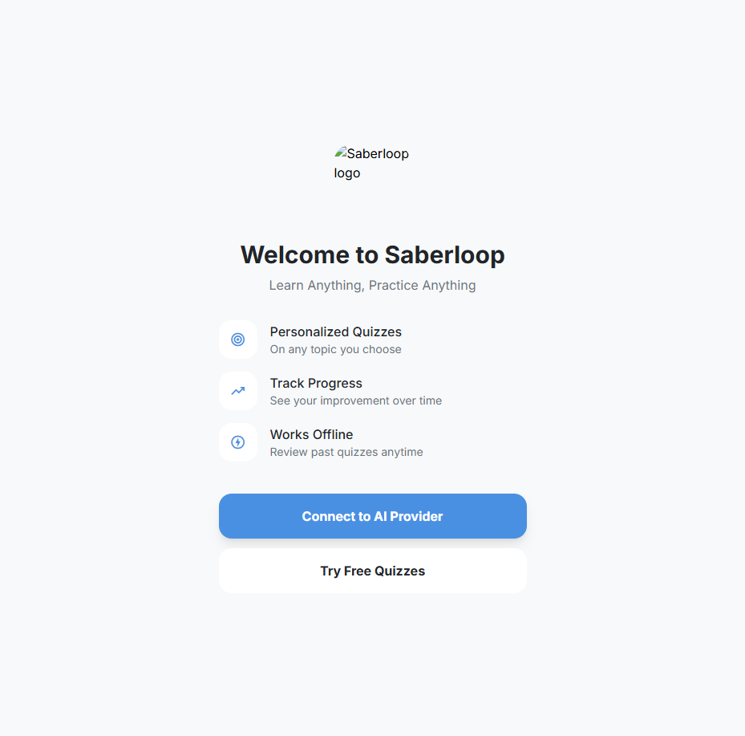
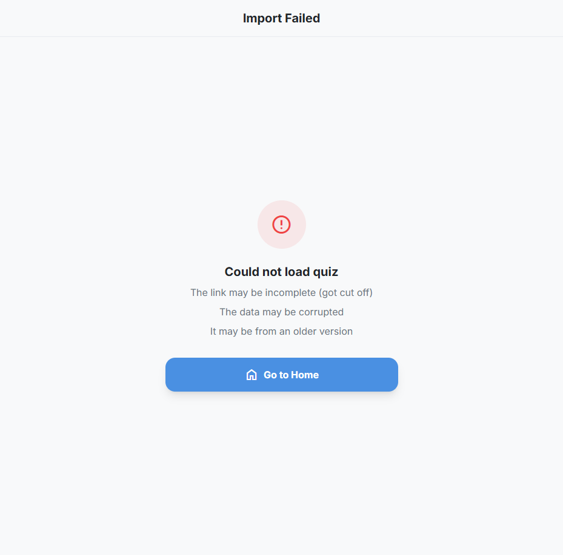

# Issue #143: Shared quiz links redirect new users to onboarding instead of quiz

**GitHub:** https://github.com/vitorsilva/saberloop/issues/143
**Status:** ✅ Fixed
**Created:** 2026-01-19
**Labels:** bug
**Branch:** `fix/issue-143-shared-quiz-onboarding`

---

## Problem

When a new user clicks a shared quiz link (e.g., `https://saberloop.com/app/#/quiz/<encoded_data>`) and it's their first time accessing the app, they get redirected to the onboarding/welcome screen instead of going directly to the import view.

**User Impact:**
- Confusing experience - user clicked a specific quiz link but landed somewhere unexpected
- Delays engagement - user must complete onboarding before playing the quiz
- Social friction - user received a quiz from a friend but can't immediately play it
- Potential drop-off - new users might give up before completing onboarding

**Expected Behavior:**
New users with a shared quiz link should go directly to the import view, bypassing the onboarding flow.

---

## Root Cause Analysis

Same timing/order problem as issue #128 in `src/main.js`:

1. **Router initializes first**: Processes `#/quiz/<encoded_data>` and renders ImportView
2. **Onboarding check runs after**: Checks if user needs onboarding and redirects to `#/welcome`
3. **Result**: The welcome redirect overwrites the import view

```javascript
// src/main.js - before fix
const showWelcome = await shouldShowWelcome();
if (showWelcome && !isPartyJoinRoute) {  // Only checks party join
  window.location.hash = '#/welcome';  // Overwrites shared quiz URL
}
```

---

## Proposed Solution

**Extend the party join fix to also skip onboarding for shared quiz URLs.**

### Implementation

Modify `src/main.js` to also check for shared quiz routes:

```javascript
// Check if current URL should bypass onboarding
const hash = window.location.hash.slice(1) || '/';
const isPartyJoinRoute = hash.startsWith('/party/join/');
const isSharedQuizRoute = hash.startsWith('/quiz/') && hash.length > 6;

// Redirect to welcome if needed (unless using shared link)
const showWelcome = await shouldShowWelcome();
if (showWelcome && !isPartyJoinRoute && !isSharedQuizRoute) {
  window.location.hash = '#/welcome';
}
```

### Why `/quiz/`

- `/quiz/<encoded_data>` is the entry point for shared quiz links - new users arrive here
- The router detects this pattern and routes to ImportView
- Consistent with the party join approach from #128

---

## Acceptance Criteria

- [x] New users clicking shared quiz links go directly to the import view
- [x] Quiz loads correctly from the shared data
- [x] Existing users (who completed onboarding) are unaffected
- [x] Direct navigation to `/welcome` still works for new users
- [x] Party join links continue to work (regression check for #128)

---

## Files to Change

| File | Change |
|------|--------|
| `src/main.js` | Add shared quiz route check to onboarding bypass logic |

---

## Testing Plan

### Automated Testing (E2E)

Created E2E test file: `tests/e2e/shared-quiz-onboarding.spec.js`

Tests cover:
1. New user with shared quiz link bypasses onboarding and sees import screen
2. New user accessing app directly (no shared link) still sees onboarding
3. Existing user with shared quiz link goes directly to import screen
4. Party join links still work (regression test for #128)

### Manual Testing Checklist

- [x] New user + shared quiz link → lands on import screen
- [x] New user + direct app access → sees onboarding as normal
- [x] Existing user + shared quiz link → lands on import screen
- [x] Party join link still works for new users

### Verification Steps

```bash
# Run E2E tests
npm run test:e2e

# Manual: Open incognito/private window
# Navigate to: https://saberloop.com/app/#/quiz/TEST_DATA
# Verify: Import screen appears (not Welcome screen)
```

---

## Pre-Implementation Checklist

- [x] Root cause identified
- [x] Solution designed
- [x] Testing plan defined
- [x] Branch created
- [x] Plan validated by user

---

## Screenshots

### Before Fix (Current Behavior)

New user clicks shared quiz link → redirected to onboarding:



### After Fix (Expected Behavior)

New user clicks shared quiz link → import view loads directly:



---

## Branch & Commit Strategy

### Branch

```
fix/issue-143-shared-quiz-onboarding
```

### Commit Plan

| Order | Commit Message | Status |
|-------|----------------|--------|
| 1 | `test(e2e): add failing test for shared quiz onboarding bypass` | ✅ Done |
| 2 | `fix(onboarding): allow shared quiz routes to bypass welcome redirect` | ✅ Done |
| 3 | `docs(issues): mark issue 143 as fixed` | ✅ Done |

---

## Implementation Notes

### Session: 2026-01-19

**Implementation completed successfully.**

1. **Test-first approach**: Created `tests/e2e/shared-quiz-onboarding.spec.js` with 4 test cases
   - Tests initially failed, confirming the bug exists
   - After fix, all 4 tests pass

2. **Fix implemented**: Added shared quiz route check in `src/main.js:115`
   - Checks if URL starts with `/quiz/` and has encoded data (length > 6)
   - Minimal, targeted change (1 line added, 2 modified)

3. **No regressions**: Party join onboarding bypass tests still pass (5 tests)
   - 1 pre-existing flaky test (timing issue, passed on retry)

4. **Commits**:
   - `9538b60`: test(e2e): add failing test for shared quiz onboarding bypass
   - (pending): fix(onboarding): allow shared quiz routes to bypass welcome redirect

---

## References

- Related issue: #128 (party join onboarding bypass)
- Router handling: `src/core/router.js:35-40`
- Onboarding redirect: `src/main.js:110-123`
- Onboarding logic: `src/features/onboarding.js`
- ImportView: `src/views/ImportView.js`
